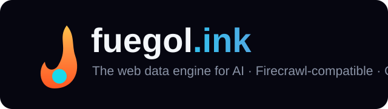
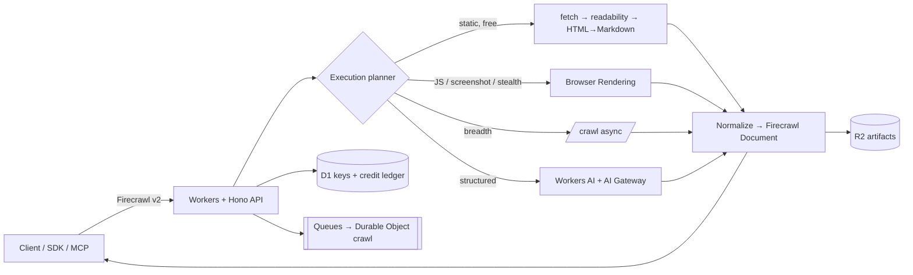
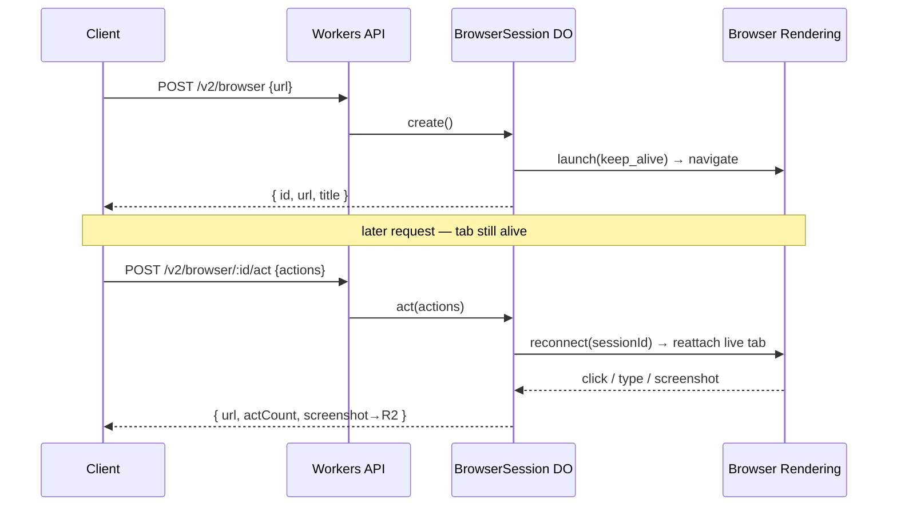

<p align="center">
  
</p>

<h1 align="center">fuegol.ink</h1>

<p align="center">
  <strong>The web data engine for AI. Firecrawl-compatible. Cloudflare-powered. Half the price.</strong>
</p>

<p align="center">
  <a href="https://fuegol-web.manhattan.workers.dev">Website</a> ·
  <a href="https://fuegol-web.manhattan.workers.dev/app/">Console</a> ·
  <a href="https://fuegol-api.manhattan.workers.dev">Live API</a> ·
  <a href="https://fuegol-mcp.manhattan.workers.dev">MCP</a> ·
  <a href="docs/firecrawl-compatibility.md">Compatibility</a> ·
  <a href="docs/implementation-roadmap.md">Roadmap</a> ·
  <a href="deploy/README.md">Self-host</a> ·
  <a href="LICENSE">MIT</a>
</p>

<p align="center">
  <a href="https://github.com/heymegabyte/fuegol.ink/actions/workflows/ci.yml"></a>
  
  
  
  
  
</p>

---

fuegol.ink is an open-source, **Cloudflare-native** web-data platform that speaks the
**Firecrawl v2 API**. Point an existing Firecrawl client at `api.fuegol.ink`, swap in a fuegol key,
and keep your code. The managed edition targets **≈50% of Firecrawl's published plans**; the engine
is MIT and self-hostable on your own Cloudflare account.

> **Compatibility means:** change your base URL + use a **new fuegol key** (never your `fc-` key).
> Your request/response business logic stays the same.

## 30-second quickstart

The public demo is live and keyless (rate-limited). Scrape any page to clean Markdown:

```sh
curl -X POST https://fuegol-api.manhattan.workers.dev/v2/scrape \
  -H 'content-type: application/json' \
  -d '{"url":"https://example.com","formats":["markdown","links"]}'
```

Real response (trimmed):

```json
{
  "success": true,
  "data": {
    "url": "https://example.com/",
    "title": "Example Domain",
    "markdown": "This domain is for use in documentation examples without needing permission. This is not a service; avoid relying on it for testing and monitoring purposes.",
    "links": [],
    "metadata": {
      "statusCode": 200,
      "title": "Example Domain",
      "language": "en",
      "sourceURL": "https://example.com/",
      "contentType": "text/html; charset=utf-8"
    }
  }
}
```

<sub>Verbatim from the live endpoint on 2026-10-07 (example.com was redesigned — it no longer links out).</sub>

Map a site's URLs:

```sh
curl -X POST https://fuegol-api.manhattan.workers.dev/v2/map \
  -H 'content-type: application/json' -d '{"url":"https://example.com","limit":50}'
```

## How it works

A request enters a **cheapest-adequate-tier planner**. Most pages never touch a browser — they are
served by a free static path (SSRF-guarded `fetch` → readability extraction → HTML→Markdown). The
browser tier is reserved for pages that truly need JS, actions, screenshots, or an anti-bot proxy.



Edge primitives: **Workers + Hono · Browser Rendering · Queues · Workflows · Durable Objects ·
D1 · R2 · Workers AI · AI Gateway · AI Search**. No portability layer — the CF integration _is_ the
cost and latency advantage. See [`docs/architecture-decisions.md`](docs/architecture-decisions.md).

## What works today

Every row below is live on the production API and covered by a reproducible prod E2E in [`e2e/`](e2e/).

| Capability                                                                                                                               | Status                                              |
| ---------------------------------------------------------------------------------------------------------------------------------------- | --------------------------------------------------- |
| `POST /v2/scrape` → markdown / html / rawHtml / links / summary / metadata                                                               | ✅ live                                             |
| `POST /v2/scrape` → `{type:"json"}` AI extraction (Workers AI)                                                                           | ✅ live                                             |
| `POST /v2/scrape` → JS-rendered (Browser Rendering) + `screenshot` → R2                                                                  | ✅ live                                             |
| `POST /v2/scrape` → `actions` (click/write/press/scroll/wait/screenshot/scrape/executeJavascript/pdf)                                    | ✅ live                                             |
| `POST /v2/scrape` → `changeTracking` (git-diff **+ AI `json` semantic diff**)                                                            | ✅ live                                             |
| `POST /v2/scrape` → `maxAge` result cache (R2, content-addressed) + `storeInCache`                                                       | ✅ live                                             |
| `POST /v2/extract` async structured extraction (Workers AI, Durable Object)                                                              | ✅ live                                             |
| `POST /v2/map` → sitemap + link discovery                                                                                                | ✅ live                                             |
| `POST /v2/crawl` + `POST /v2/batch/scrape` async (Durable Object) + status/cancel/errors + **signed webhooks**                           | ✅ live                                             |
| `POST /v2/search` → multi-source (`web` / `news` / `images`) + categories + `tbs` time-filter + optional result-scraping (Exa/Tavily)    | ✅ live                                             |
| `POST /v2/parse` — PDF (unpdf) + HTML/text → markdown                                                                                    | ✅ live                                             |
| `POST /v2/agent` — autonomous research (search → scrape → synthesize + sources)                                                          | ✅ live                                             |
| `POST /v2/monitor` (+ run/checks) — recurring change detection on Cron **+ signed `monitor.changed` webhooks**                           | ✅ live                                             |
| `POST /v2/browser` + `/browser/:id/act` — **persistent interactive browser sessions** (state persists across requests)                   | ✅ live                                             |
| `POST /v2/ai-search/index` + `/query` — **AI Search**: semantic search + RAG over your indexed content (Vectorize + Workers AI, per-key) | ✅ live                                             |
| API keys (`POST /v2/keys`) + D1 credit ledger, **enforced spend ceilings** (402) + user spend limits                                     | ✅ live                                             |
| SSRF guard (v4/v6/metadata/redirect/DoH), robots.txt, honest error envelopes, `/v1/*` adapters, `/concurrency-check`                     | ✅ live                                             |
| Remote **MCP** — scrape/map/crawl/search + developer/gov/research search + agent + monitor_* + research inspect/related/read             | ✅ live                                             |
| Dev **console** `/app/` — keys, live credits, playground (scrape/map/search/crawl) **+ interactive-session playground**                  | ✅ live                                             |
| Stripe billing · custom domains · one-click Deploy button                                                                                | ⛔ roadmap (needs a Stripe test key / the DNS zone) |
| `find_tools` (Alexandria data-provider catalogue)                                                                                        | ⛔ proprietary upstream                             |

Full surface map: [`docs/product-surface-inventory.md`](docs/product-surface-inventory.md). Every
unbuilt endpoint returns an honest `501` with a pointer — never a fake success object. Real
wall-clock numbers (static scrape P50 ≈ 100 ms, browser tier ≈ 1.5 s) live in
[`docs/benchmarks.md`](docs/benchmarks.md), reproducible via `node e2e/benchmark/run.mjs`.

## Firecrawl compatibility

Pinned to the real upstream source (there is **no committed v2 OpenAPI** — the contract lives in
Firecrawl's Zod, which we mirror in [`packages/contracts`](packages/contracts)):

| Surface     | Pinned revision                                                                               |
| ----------- | --------------------------------------------------------------------------------------------- |
| REST API v2 | `firecrawl/firecrawl@f9f2e3d`                                                                 |
| MCP server  | `firecrawl-mcp-server@ec0f9de` (`firecrawl-mcp@3.28.2`) — **30 tools registered / 28 listed** |

The MCP server's README says "27 tools"; the source at HEAD registers **30** (28 listable + 2 hidden
deprecated shims). We pin to the source count. Details: [`docs/firecrawl-compatibility.md`](docs/firecrawl-compatibility.md).

## Pricing (proposed — managed edition, Stripe test mode)

Targets are **≈50% of Firecrawl's annual-billed, monthly-equivalent** prices (retrieved 2026-10-07).
Not yet live; billing is Increment 5 and stays in test mode until explicitly approved.

| Tier     | Monthly credits | Firecrawl (annual-equiv) | **fuegol target** |
| -------- | --------------: | -----------------------: | ----------------: |
| Free     |           1,000 |                       $0 |            **$0** |
| Hobby    |           5,000 |                      $16 |            **$8** |
| Standard |         100,000 |                      $83 |           **$42** |
| Growth   |         500,000 |                     $333 |          **$167** |
| Scale    |       1,000,000 |                     $599 |          **$300** |

Cost model + margin thesis: [`docs/unit-economics.md`](docs/unit-economics.md).

## Examples

**TypeScript**

```ts
const res = await fetch('https://fuegol-api.manhattan.workers.dev/v2/scrape', {
  method: 'POST',
  headers: { 'content-type': 'application/json' /* , authorization: `Bearer ${fuegolKey}` */ },
  body: JSON.stringify({ url: 'https://example.com', formats: ['markdown', 'links'] }),
});
const { data } = await res.json();
console.log(data.markdown);
```

**Python**

```python
import requests
r = requests.post("https://fuegol-api.manhattan.workers.dev/v2/scrape",
                  json={"url": "https://example.com", "formats": ["markdown"]})
print(r.json()["data"]["markdown"])
```

**CLI** (`@fuegol/cli` — zero-dependency)

```sh
fuegol scrape https://example.com
fuegol search "durable objects" --category developer
FUEGOL_API_KEY=fgl_live_… fuegol crawl https://docs.site --limit 20 --wait
```

**MCP** — live at `https://fuegol-mcp.manhattan.workers.dev`. Real working tools: `firecrawl_scrape`,
`firecrawl_map`, `firecrawl_crawl`, `firecrawl_check_crawl_status`, `firecrawl_search` (web/news/images),
`firecrawl_developer_search`, `firecrawl_gov_search`, `firecrawl_research_search_papers`,
`firecrawl_research_inspect_paper` / `_related_papers` / `_read_paper` (Semantic Scholar),
`firecrawl_agent`, and `firecrawl_monitor_create` / `_list` / `_run` / `_checks` (the MCP forwards your
Bearer key so authed tools hit your ledger). Only `firecrawl_find_tools` (proprietary) is a stub.
Stateless Streamable-HTTP JSON-RPC.

```jsonc
{ "mcpServers": { "fuegol": { "url": "https://fuegol-mcp.manhattan.workers.dev/v2/mcp" } } }
```

```sh
# verify it live:
curl -X POST https://fuegol-mcp.manhattan.workers.dev/v2/mcp -H 'content-type: application/json' \
  -d '{"jsonrpc":"2.0","id":1,"method":"tools/call","params":{"name":"firecrawl_scrape","arguments":{"url":"https://example.com"}}}'
```

**Interactive browser sessions** — drive a persistent headless browser; the tab's state (URL,
cookies, form input) survives across separate requests:

```sh
# start a session, then click "next" + screenshot — the tab persists between calls
ID=$(curl -s -X POST https://fuegol-api.manhattan.workers.dev/v2/browser \
  -H 'content-type: application/json' -d '{"url":"https://quotes.toscrape.com/"}' | jq -r .id)
curl -X POST https://fuegol-api.manhattan.workers.dev/v2/browser/$ID/act \
  -H 'content-type: application/json' \
  -d '{"actions":[{"type":"click","selector":"li.next a"},{"type":"screenshot"}]}'
```



Or drive it visually in the [console playground](https://fuegol-web.manhattan.workers.dev/app/).

## Migrating from Firecrawl

```diff
- const base = 'https://api.firecrawl.dev';
- const key  = 'fc-...';
+ const base = 'https://api.fuegol.ink';   // or your self-hosted Worker
+ const key  = 'fgl-...';                  // a NEW fuegol key — fc- keys are not accepted
```

Or use the **official Firecrawl SDK** unchanged — just point it at fuegol:

```ts
import { Firecrawl } from '@mendable/firecrawl-js';
const app = new Firecrawl({ apiKey: 'fgl_live_...', apiUrl: 'https://api.fuegol.ink' });
const doc = await app.scrape('https://example.com', { formats: ['markdown'] });
```

> **Verified against both official SDKs:** `@mendable/firecrawl-js@4.45.0` **8/8** and
> `firecrawl-py@4.49.3` **4/4** run unchanged against fuegol.ink — scrape · map · search · crawl
> (+ batch/extract/status in TS). Reproduce: `node e2e/sdk-compat/test.mjs` · `python e2e/sdk-compat/test.py`.

Your scrape/map/crawl request bodies and response handling stay the same (within the supported
surface above). A fuegol key is required — an existing Firecrawl key is never automatically valid.

## Self-hosting

MIT-licensed; runs on **your** Cloudflare account with no Stripe and no dependency on fuegol.ink
infrastructure. The free static tier needs zero extra provisioning. See [`deploy/README.md`](deploy/README.md).

```sh
git clone https://github.com/heymegabyte/fuegol.ink.git && cd fuegol.ink
pnpm install && cd apps/api && pnpm exec wrangler deploy
```

> **Deploy-to-Cloudflare button:** Cloudflare's one-click button can't resolve a pnpm monorepo's
> workspace packages at build time (documented limitation). The dependency-isolated standalone Worker
> for one-click deploy is a tracked increment — we won't show a "working" badge until it's tested from
> a clean account. The manual command above is verified.

## Security & privacy

- **SSRF-hardened** fetch: blocks private/reserved IPv4+IPv6, cloud-metadata endpoints, non-http(s)
  schemes, and re-validates every redirect hop; optional DNS-over-HTTPS rebinding check.
- Respects `robots.txt` and Cloudflare Content Signals. No CAPTCHA bypass, credential theft, private-
  network scanning, or paywall circumvention.
- **Signed webhooks** (HMAC-SHA256, `x-fuegol-signature`) fire on crawl/batch completion **and on
  monitor change detection** (`monitor.changed`), with retries. Webhook targets are SSRF-guarded.
- Zero-data-retention mode, PII redaction, and per-tenant isolation are on the roadmap.
- **Observability:** server-side **Sentry** (`@sentry/cloudflare`) on the API + MCP Workers —
  errors + traces, with every Durable Object instrumented — plus Workers Tracing. No browser SDK.

## Repository layout

```
packages/contracts  Zod SSOT — Firecrawl v2 request/response schemas (the spec mirror)
packages/engine     Cloudflare-native engine — SSRF, fetch, extraction, HTML→MD, planner
apps/api            Hono Worker — the Firecrawl-compatible REST API (live)
docs/               idea-ledger · compatibility · surface-inventory · unit-economics · ADRs · roadmap · convergence-log
deploy/             self-hosting guide + standalone-template plan
```

## Contributing

Issues and PRs welcome. Run `pnpm install`, then `pnpm -r typecheck` and `pnpm --filter @fuegol/engine test`.
Add a regression test with every bug fix; keep the Zod contracts authoritative.

## License

[MIT](LICENSE) © 2026 Megabyte Labs. Not affiliated with Firecrawl; "Firecrawl" is used only to
describe API compatibility. A clean-room implementation pinned to public upstream revisions.

---

<p align="center"><strong>Point your client at fuegol.ink. Keep your code. Pay half.</strong></p>
